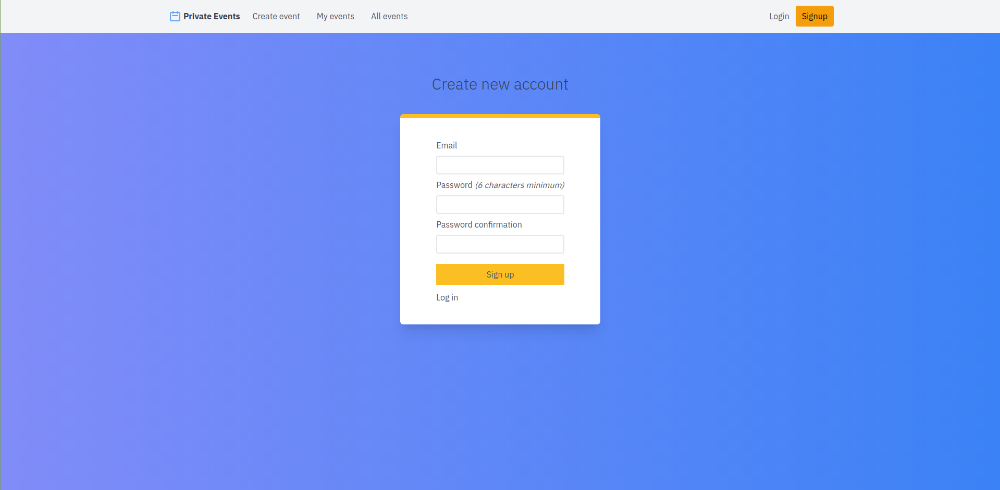

# Project: Private Events

A site similar to a private Eventbrite which allows users to create events and then manage user signups. Users can create events and Attend parties (sound familiar?). Events take place at a specific date and at a location (which you can just store as a string, like “Andy’s House”).

A user can create events. A user can attend many events. An event can be attended by many users.

### Clone the project

- Clone the repo and run the app.

```bash
$ git clone https://github.com/M-Alamgir/private-events.git
$ cd private-events

```

### Run bundle install and migrate as follows:

```bash
bundle install

rails db:migrate
```

### Run the rails console

```bash
rails console

```

## Screenshots

### Login Page

`http://127.0.0.1:3000/users/sign_in`


### Sign up Page

`http://127.0.0.1:3000/users/sign_up`


### All Events list

`http://127.0.0.1:3000/`


### My hosted events

`http://127.0.0.1:3000/events/event`


### Create New event

`http://127.0.0.1:3000/events/new`


### View event

`http://127.0.0.1:3000/events/1`


## Ruby version

    ruby 2.7.0p0

## Rails version

    Rails 6.1.3.1

👤 **Alamgir**

- GitHub: [@M-Alamgir](https://github.com/M-Alamgir)
- Twitter: [@Alphacrescent1](https://twitter.com/Alphacrescent1)

## Acknowledgment
The resources we have used to develop our project:

- [Odin-project](https://www.theodinproject.com/paths/full-stack-ruby-on-rails/courses/ruby-on-rails/lessons/associations)

## Show your support

Give ⭐ Star me on GitHub — it helps!

## 🤝 Contributing

Contributions, issues, and feature requests are welcome!

## 📝 License

This project is [MIT](https://opensource.org/licenses/MIT) licensed. 